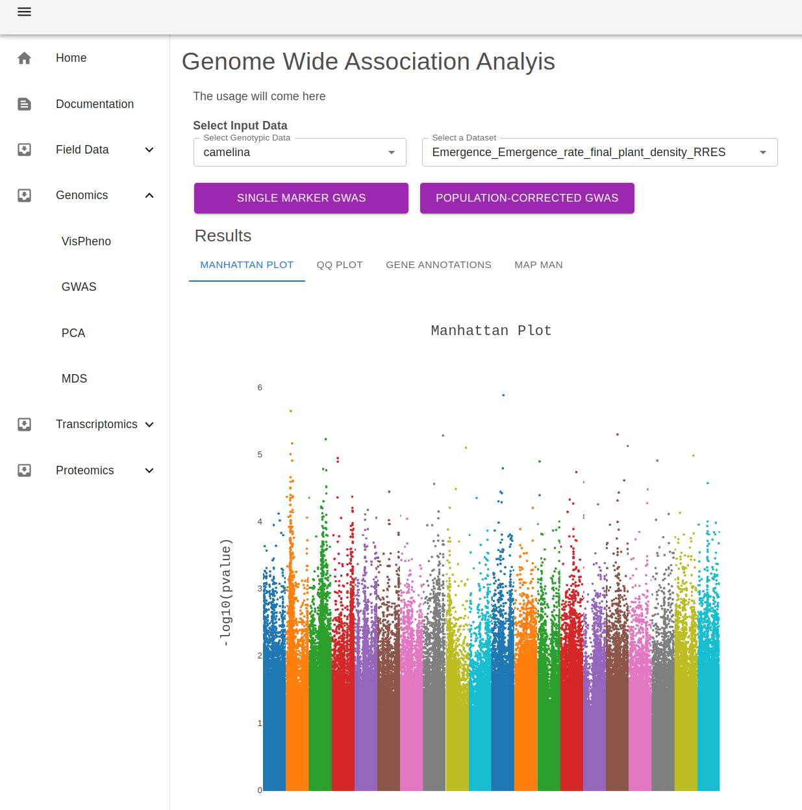
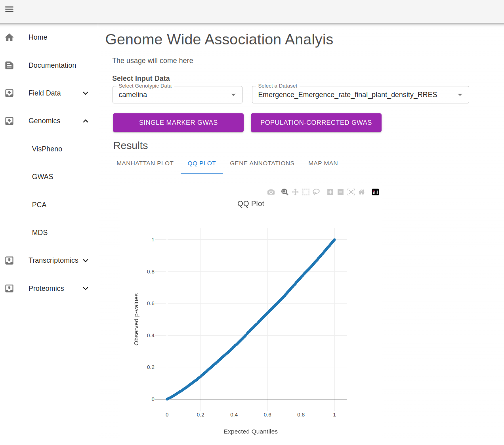
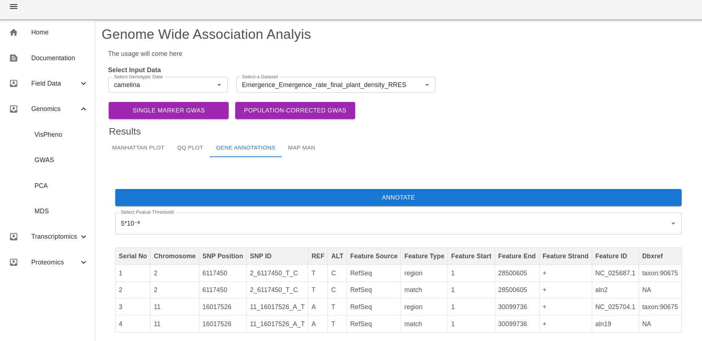
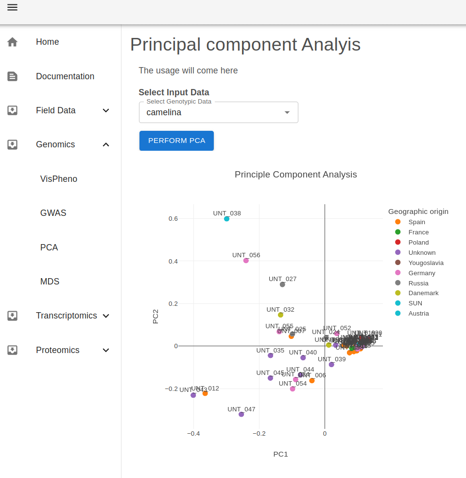
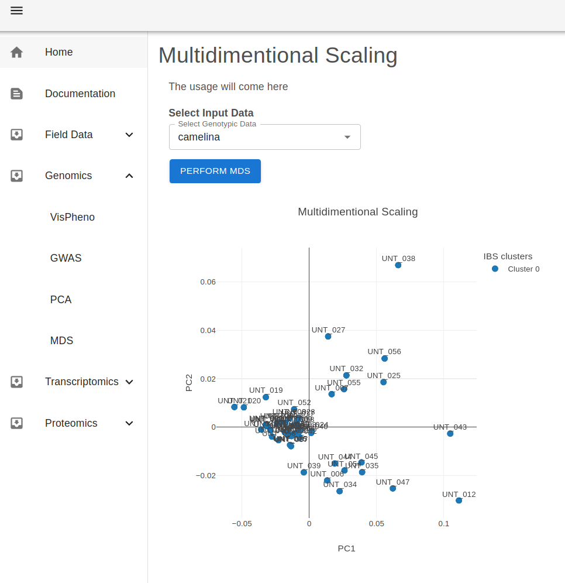

## Manhattan plot

## QQ plot

## Structural annotation

## Funtional Annotations

still need to find a phenotype where the resulting genes are known for mercartor bin categories (known function)

## PCA plot

## MDS plot

