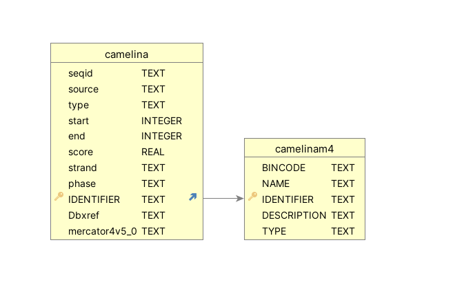

## Description
Untwsit app is a web tool for the analysis and visualization of GWAS datasets related to untwist poject

### Genotypic Data
[Click here for details](./ProjectDocs/CamelinaData.md)
### Phenotypic Data

### Tools
### VisPheno 

### GWAS 
#### Without correction for population structure

#### With correction for population structure

### MDS 

### PCA 

## Annotations

Camelina reference genome is downloaded from here

[https://www.ncbi.nlm.nih.gov/datasets/taxonomy/90675/](https://www.ncbi.nlm.nih.gov/datasets/taxonomy/90675/)

Annotations of genomic features are taken from here 

[https://ftp.ncbi.nlm.nih.gov/genomes/all/annotation_releases/90675/101/GCF_000633955.1_Cs/GCF_000633955.1_Cs_genomic.gff.gz](https://ftp.ncbi.nlm.nih.gov/genomes/all/annotation_releases/90675/101/GCF_000633955.1_Cs/GCF_000633955.1_Cs_genomic.gff.gz)

Camelina protein sequence file

[https://ftp.ncbi.nlm.nih.gov/genomes/all/annotation_releases/90675/101/GCF_000633955.1_Cs/GCF_000633955.1_Cs_protein.faa.gz](https://ftp.ncbi.nlm.nih.gov/genomes/all/annotation_releases/90675/101/GCF_000633955.1_Cs/GCF_000633955.1_Cs_protein.faa.gz)

Mercator-4 annotations 

saved as part of the db

The database schema look like this
camelina : camelina structural annotations
camelinam4 : mercartorV4.5 annotations

## IMAGES of Analysis output

[Analysis Images (Click)](ProjectDocs/images.md)