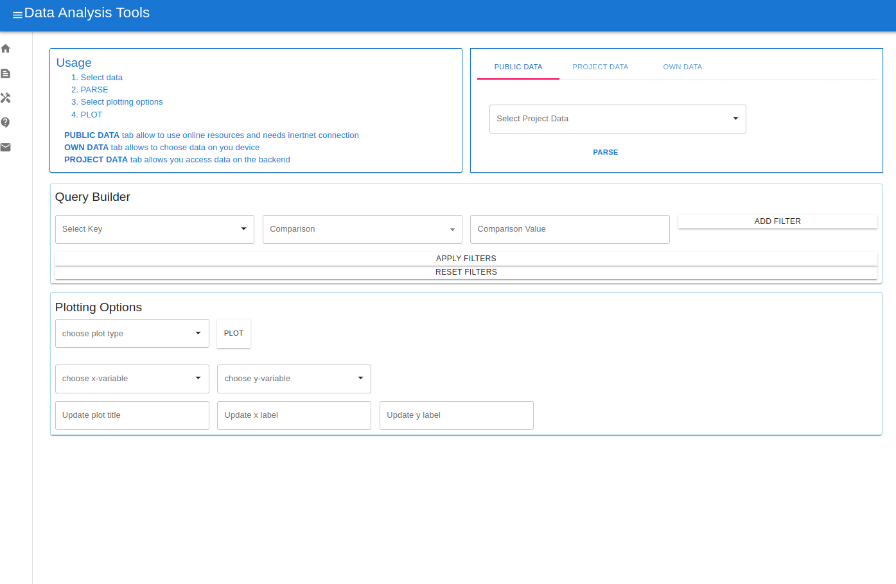
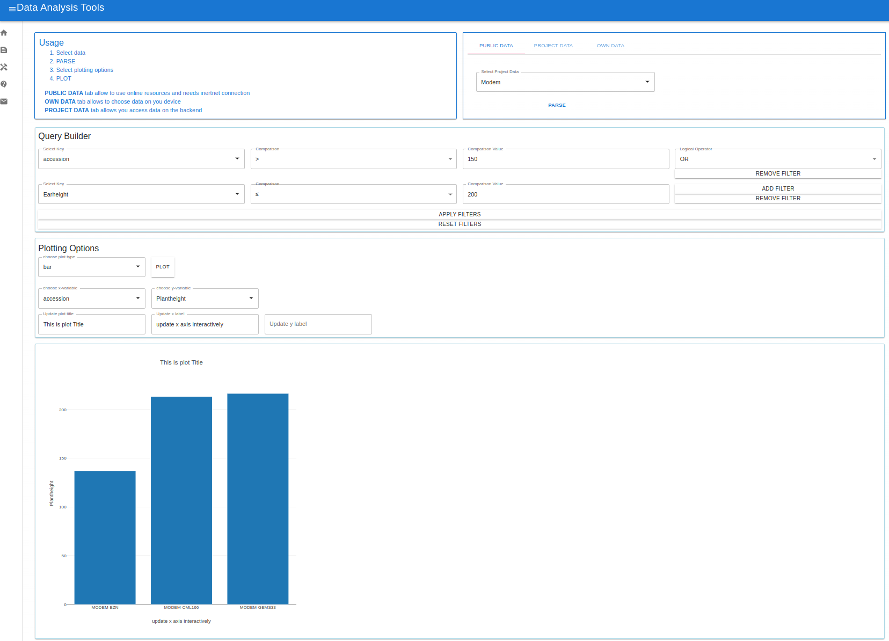
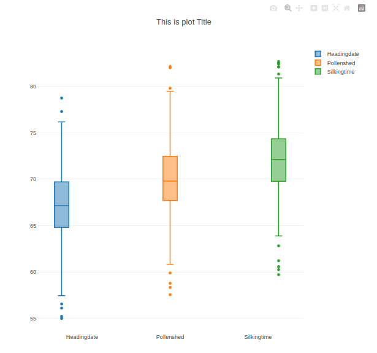
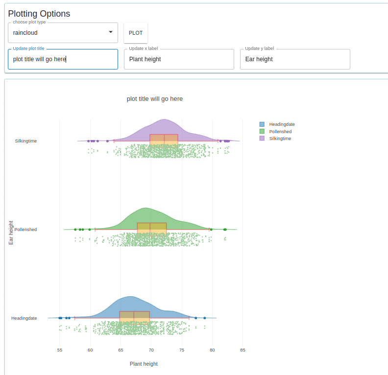
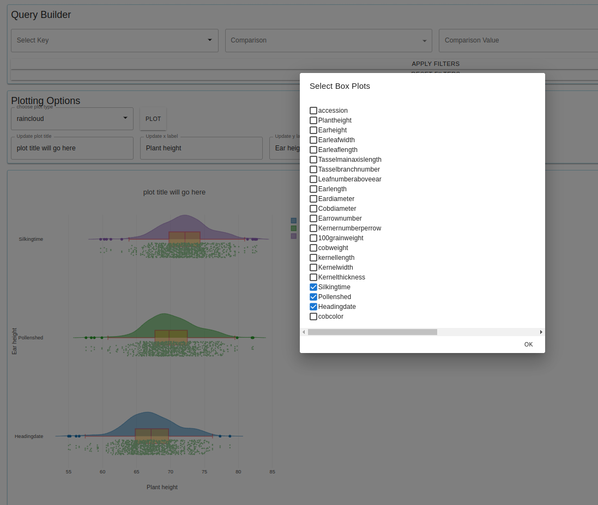
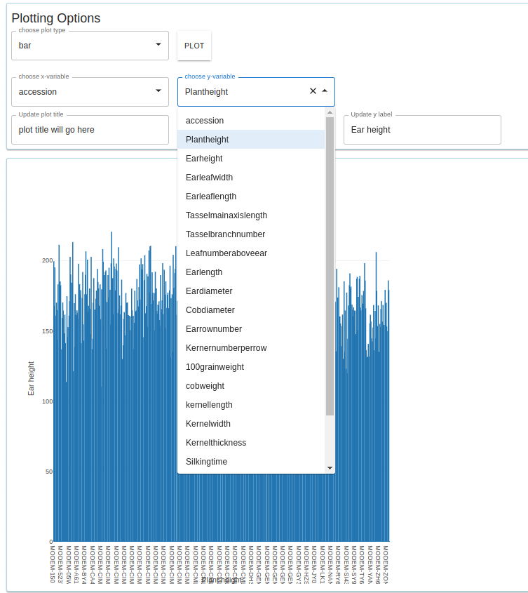
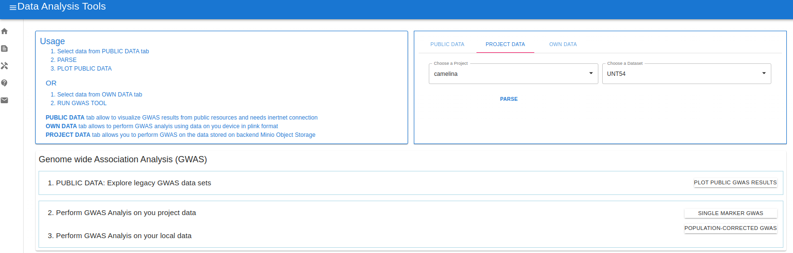
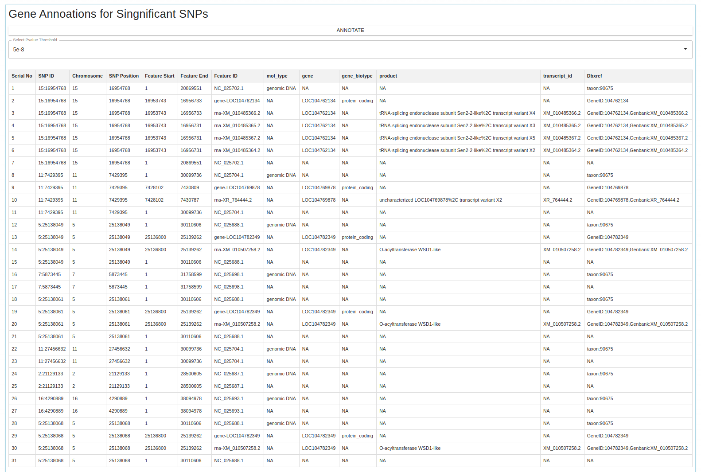
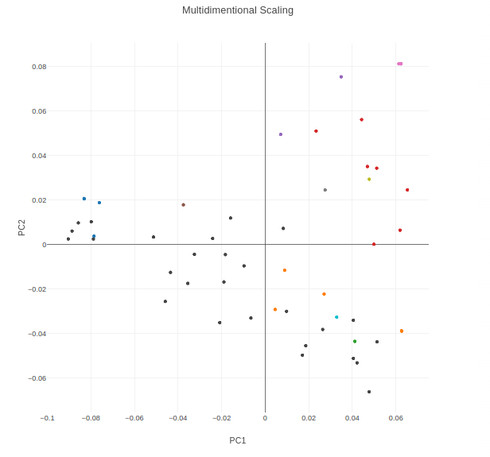
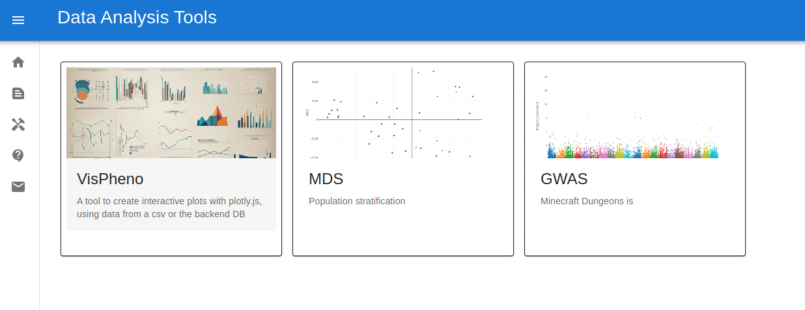

## The app provides following tools of analysis currently

General features

1. Consume data from online public resources, backend Minio Object storage database, as well as ability to handle custom data sets from local machine
2. Data is not sent to server for analysis, its all processed on the client side

## Component 1. VisPheno (visualization of phenotypic data)

Tool welcome page

The capabilites of this tool are as follows

#### 1. Query builder

Can apply comparison filters to build simple query for filtering the input dataset as well build complex queries by using logical operators. It allows any number of filters one want to apply. one reset button will reset the data to original data set.

Allows for interactively updating plot labels

Supports following Plot types 

Line plot, bar plot, histogram, box plot, scatter plot, linear regression, violin plots and rain cloud plots

## Component 2. GWAS Analysis (Analysis and visualization of GWAWS data)

Allow to perform GWAS analysis on the data stored in the backend MinioDb as well as from your local machine

1. can perform GWAS analysis with out population correction (plink commands --assoc for qualitative as well as qunatitative response variable)
2. can perform GWAS analysis with correction for population correction 

    For correction of structure MDS analysis is performed and first two coordinates are used as covariates in a linear model (using plink's --linear)

    I plan to test how IBS matrix as well as genetic distance matrix impacts our results

3. using the latest gene model one can see the structural/functional annotations of the genes currently available from the latest release

    user can select a pvalue threshold of significance for GWAS results and SNP id and the annotations in the resulting table will be automatically updated
    I am now building MapMan.js for significant hits

4. Multithreaded support is underway

Some of the images are below

GWAS tool welcome page 

Manhattan plot showing GWAS results

Gene Annotations 

## Component 3. Multidimentional Scaling (Analysis and visualization of Genomic data)

MDS plot

    the coordinates are based on MDS analysis
    the colors represent IBS based clusters (need further fine tuning)

welcome page

tools page

